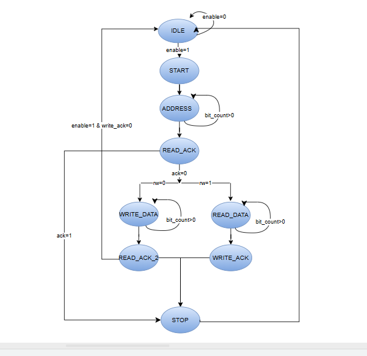
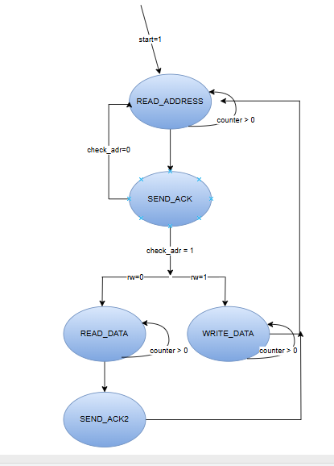
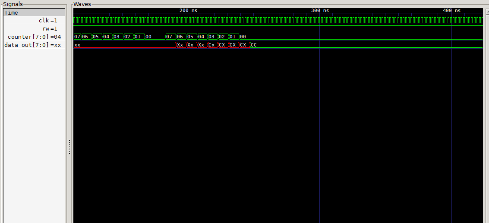
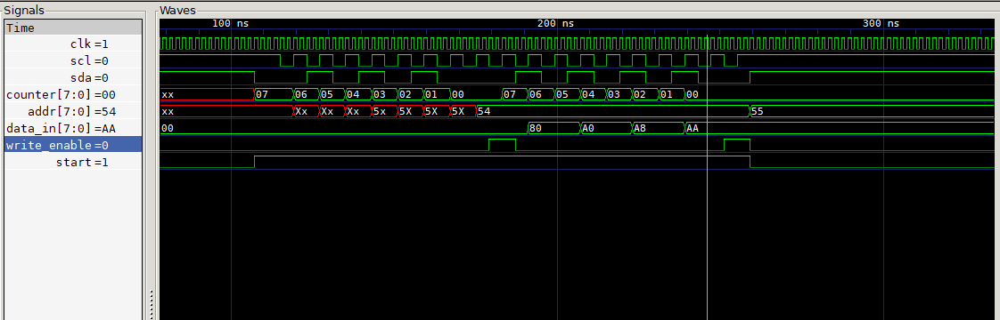
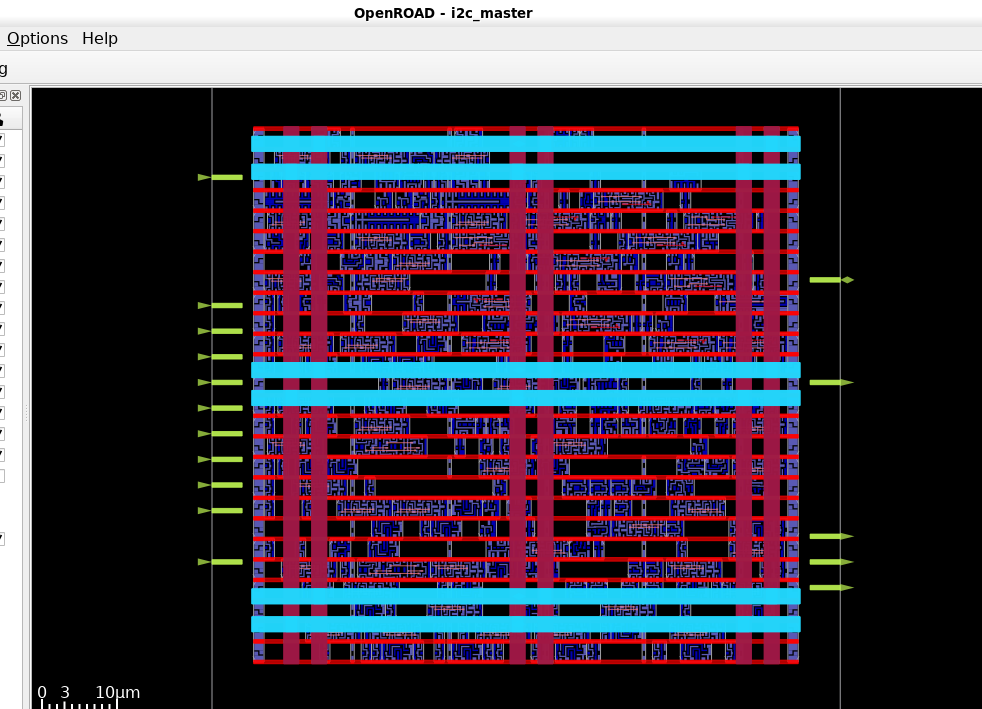

# I2C Design Project

This project implements an I2C communication circuit, including an **I2C master** and a **slave device** used for testing.

## Structure

- The `master` initiates and controls the I2C communication.
- The `slave` responds to the master's commands and supports both read and write operations.

## Simulation Results

- All simulation files and results are located in the `simulator` and `result` folders.

## Data Transmission Behavior

- When `rw = 0`:  
  → The master writes data to the slave.  
  → In this test, the master sends the value `0xAA` to the slave.

- When `rw = 1`:  
  → The master reads data from the slave.  
  → In this test, the slave sends the value `0xCC` to the master.

## Notes
- You can view waveform results using tools like GTKWave.

## FSM
- FSM for master

- FSM for slave

## SIMULATION
- read data from slave

- read data from master

## IC

